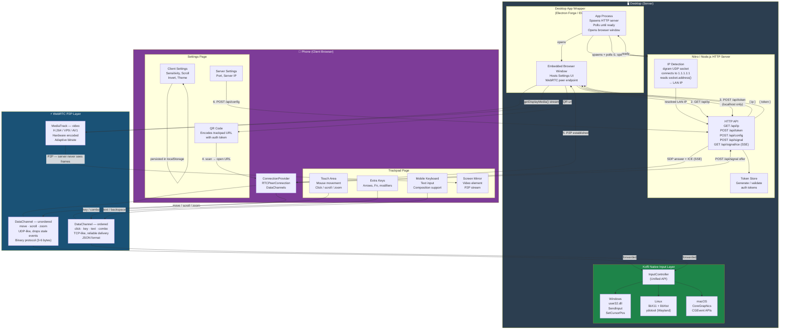
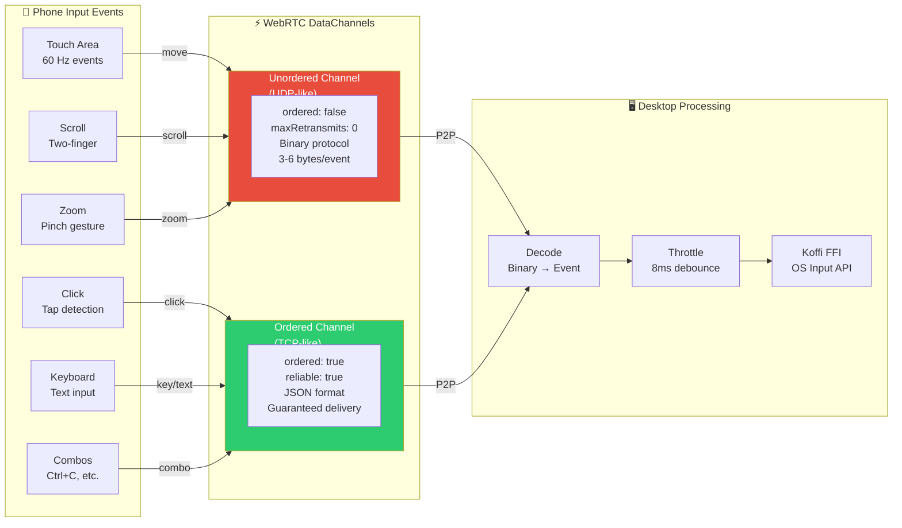
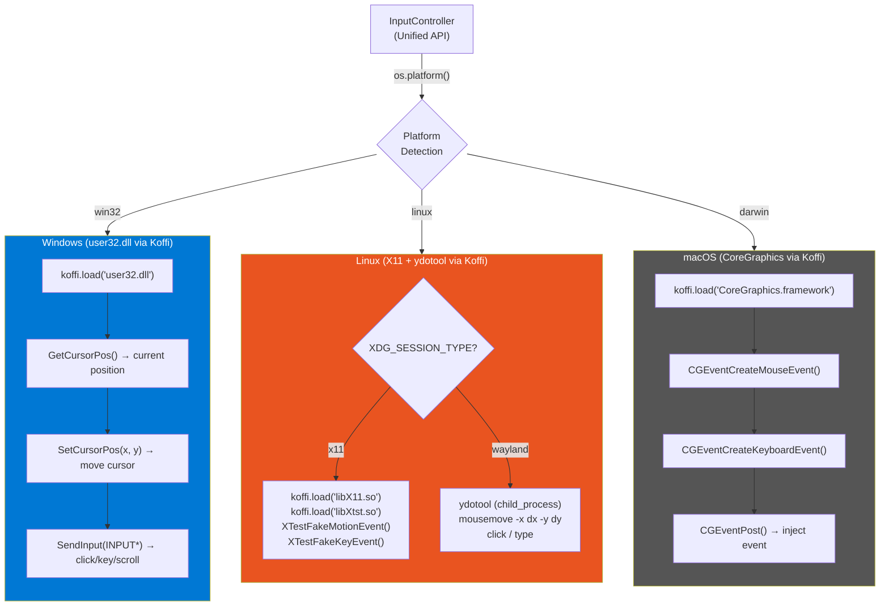
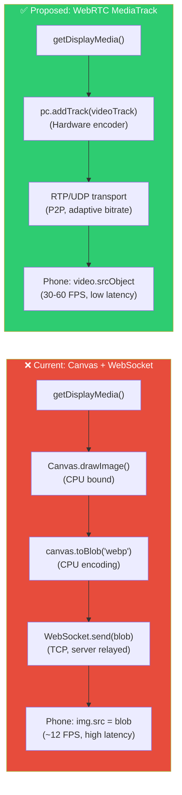
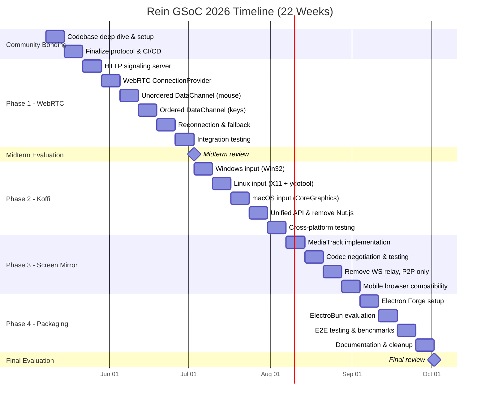
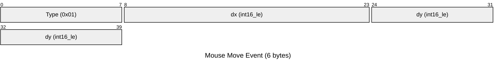

# Rein Architecture Diagrams (Mermaid)

## How to Use:
## 1. Go to https://mermaid.live
## 2. Copy each diagram code block
## 3. Paste in the editor
## 4. Export as PNG (click download icon)
## 5. Embed in your Google Doc

---

## Diagram 1: Full End-to-End Architecture (MAIN DIAGRAM)



---

## Diagram 2: WebRTC Signaling Sequence

```mermaid
sequenceDiagram
    participant Phone as 📱 Phone
    participant Server as 🌐 HTTP Server
    participant Desktop as 🖥️ Desktop

    Note over Phone, Desktop: Phase 1: Discovery & Authentication

    Desktop->>Server: GET /api/ip
    Server-->>Desktop: { ip: 192.168.x.x }
    Desktop->>Server: POST /api/token (localhost only)
    Server-->>Desktop: { token: "abc123" }
    Desktop->>Desktop: Generate QR Code with token

    Note over Phone, Desktop: Phase 2: WebRTC Signaling

    Phone->>Phone: Scan QR → Open URL
    Desktop->>Server: GET /api/signal/ice (SSE, role=desktop)
    Note right of Server: SSE stream open

    Phone->>Phone: Create RTCPeerConnection
    Phone->>Phone: Create DataChannels (ordered + unordered)
    Phone->>Phone: Create SDP Offer
    Phone->>Server: POST /api/signal { type: "offer", sdp }
    Server-->>Desktop: SSE event: { type: "offer", sdp }

    Desktop->>Desktop: setRemoteDescription(offer)
    Desktop->>Desktop: Create SDP Answer
    Desktop->>Server: POST /api/signal { type: "answer", sdp }
    Server-->>Phone: Return answer in HTTP response

    Phone->>Phone: setRemoteDescription(answer)

    Note over Phone, Desktop: Phase 3: ICE Candidate Exchange

    Phone->>Server: POST /api/signal { type: "candidate", from: "phone" }
    Server-->>Desktop: SSE event: { type: "candidate" }
    Desktop->>Server: POST /api/signal { type: "candidate", from: "desktop" }
    Server-->>Phone: SSE event: { type: "candidate" }

    Note over Phone, Desktop: Phase 4: P2P Established ✅

    Phone<-->Desktop: DataChannel (unordered): mouse, scroll, zoom
    Phone<-->Desktop: DataChannel (ordered): key, text, click
    Desktop->>Phone: MediaTrack: screen mirror (H.264/VP9)

    Note over Server: Server is now IDLE<br/>All data flows P2P
```

---

## Diagram 3: DataChannel Architecture



---

## Diagram 4: Koffi Platform Abstraction



---

## Diagram 5: Screen Mirroring Comparison



---

## Diagram 6: Project Timeline (Gantt)



---

## Diagram 7: Binary Protocol Format



---

## How to Create Visual Diagrams:

### Option 1: Mermaid Live Editor (Recommended)
1. Go to https://mermaid.live
2. Copy a diagram code block above
3. Paste in the editor (left panel)
4. Click the download/export icon (PNG)
5. Embed PNG in your Google Doc

### Option 2: Excalidraw (For custom diagrams)
1. Go to https://excalidraw.com
2. Draw the architecture manually
3. Export as PNG
4. Better for custom styling

### Option 3: Draw.io
1. Go to https://draw.io
2. Create a new diagram
3. More formal/professional look
4. Export as PNG

### Tips for Legible Diagrams:
- Use high resolution (2x or 3x)
- Light background, dark text
- Font size 14+ for readability
- Keep diagram width under 800px
- Use color coding consistently
